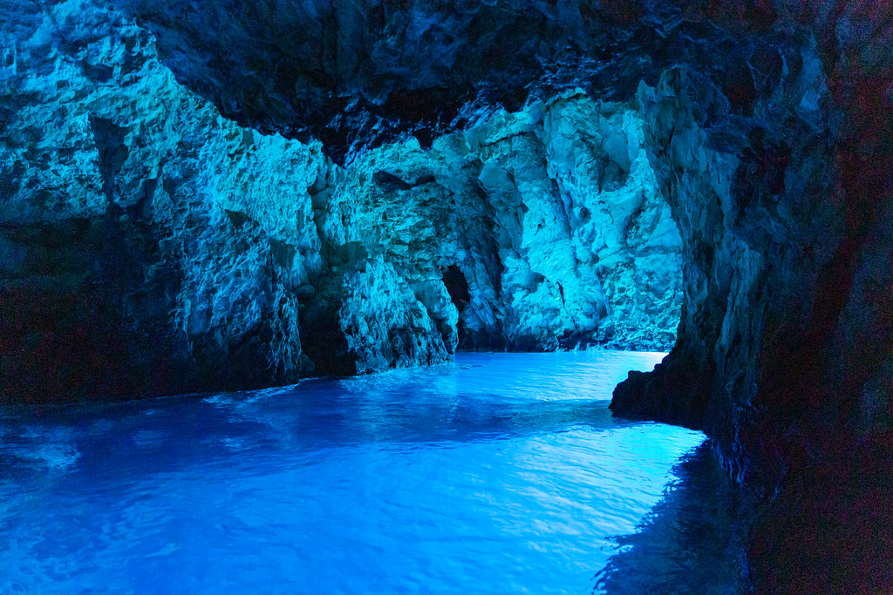

# Documentation #

## Justifications for implementation decisions: ##

Throughout the microsite, my intention was to utilise what i have learnt throughout this course. To gain encourage for this, the assistance of the navbar created by the tutors assisted me as a base to then extend off of. I was able to then implement my prototype decisons at a thorough level. 

A minor decision was the small screen size layout for the interactive page. I chose to keep this at its positon and not rotated 90 degrees as the mockup states. I feel that it would at an accessible size that viewers would see. 

Within the html and css, accessibility is considered with accurate and true alternative text descriptions and the consideration of screen resizing. I also organised both css and html with comments explaining the section which assisted massively when managing muiple html files and the long list of css. 


```HTML

```

Within the pages, i continued to utilise web-friendly fonts for titles and more ledgible fonts for text. To make the text evidently shown throgh all pages, all html headings are used:

```CSS
h1 {
  font-size: 55px;
  font-weight: 700;
  color: #FFF; /* Set font size, weight, and color for h1 */
}

h2 {
  font-size: 35px;
  font-weight: 700;
  color: #FFFFFF; /* Set font size, weight, and color for h2 */
}

h3 {
  font-size: 20px;
  font-weight: 700;
  color: #272C30; /* Set font size, weight, and color for h3 */
}

h4 {
  font-family: Questrial; /* Set another font family for h4 */
  font-size: 20px;
  font-weight: 100;
  color: #FFF; /* Set font size, weight, and color for h4 */
  text-align: center; /* Center-align h4 text */
}

h5 {
  font-family: Questrial;
  font-size: 15px;
  font-weight: 400;
  color: #FFF; /* Set font size, weight, and color for h5 */
}

h6 {
  font-size: 26px;
  font-weight: 700;
  color: #272C30; /* Set font size, weight, and color for h6 */
}
```

I also found a source for the art programs where an image slider was applied. This is referencing GreatStack shown within the html, css and bibliography. The tutorial allowed me to efficienly make an automatically image pannel where buttons are used to select the images and go back and forth. This implemmentation helps my microsite look like real-world cites of how images are displayed. 


## Comparisons between mockups and prototype: ##

Throughout the design of the website, my intention was to stay true to my mockup design as feedback revealed: 

_Design Principles and Patterns Your Wireframes exhibit great attention to detail, and both desktop and mobile layouts are meticulously planned. This level of precision is commendable. The Mockups are visually pleasant and consistent with your wireframes. The designs are not only aesthetically pleasing but also user-friendly._

With this feedback, no aeasthectic adjustments were made to the design of image. Through utilising the html and css formats i was able to match the designs of my mockups with a thorough attempt. 

A quick change however was the navbar resizing to a phone layout. In the mockup, it was intended for the navbar to expand with the links coming from the right. However, considering i utilised the resources from the tutors from the navbar, i decided that this small adjustment should be made as my didnt consider whether the background would go darker for the screen to not be overwhelming. 


## Discussion of any further iterations/improvements: ##

One thing i did change was the transparent nav bar for the home screen which would then turn white when scrolling down. This was not applied as i had spent ample time adjusting the primarily used nav bar and it was too time consuming to attempt as it was one of the first applications i made to my website prototype. 

A major note i need to discuss is that each page has acessible content for large and small screen sizes excluding the visit page. This pages html and css was created and during the process i had lost the data due to the optus service outage that had occured on wednesday and it not saving my work. Addionally prior to the screen sizing editing the geotrail images were in the works. Due to the loss of service, i had to screenshot the 2 photos of the road and the cyclepath image into the screen. This was not intended however i was on a time constraint. As this page is extremely lengthy i aimed to complete and perfect all other screens and unfortunately was not able to retieve the data for the visit.html screen. Whilst some containers within the page do adjust i would further re-iterate this design and improve it by redoing the media screen size adjustment. 

A note for further iterations is the featues box on the home page

```CSS
.features-box {
  position: relative;
  width: 95vw;
  height: 90vh; /* Adjust the height based on your header's height */
  bottom: 0;
  background-color: #5d5d5d;
  margin-left: auto;
  margin-right: auto;
  display: flex;
  flex-direction: row; /* Default is a row layout */
  justify-content: flex-start;
  align-items: flex-start;
  padding: 10px 0;
  padding-bottom: 0px;
}
```
My intention was for the features box background to always remain 'bottom:0' to the page, so when the screen is resized and the features list transform from a row to a column the features box will fill the new screen size. I was testing different height methods and position methods however i could not solve why the image wouldn't stay at the bottom. This is an improvement i would make to the design. 

Furthermore, there seems to be an issue with the navtoggle for the visit.html screen which i could not decipher. At a smaller screen size when the navlinks are embedded with the icon this is not clickable only on this page. I would intent to further iterate this design section for the website to be fully functional. 

I would also iterate putting the zoom functions on the maps and have video content for some of the images that were intended to be videos. 

Additionally, i would iterate all images to expand to the screen size with the alterative text below when clicked on. This however is a long process. 

Lastly, i would iterate the search bar to take the user to suggestions of where their applied text stated it wanted to go. For now it simply says not there, but it does consider accessibility for users who may want to speed up the process and get to a specific section. However, with this proposed iteration, specifically in the visit.html file, i included the buttons at the top of the screen that would automatically scroll down the page to the intended topic. To extend off of this, i would add an chevron icon that suggests to the users on the side of the page a prompt to scroll up, where when clicked, the screen would automatically scroll back up to the top of the screen. 

## Browser Testing ##

#### tested browsers for laptop:
- Google Chrome
- Safari
- 
#### tested browsers for phone:
- Google Chrome
- Safari


# Bibliography

- Biševo – Holiday Rentals & Places to stay - split-dalmatia county. Airbnb. (n.d.). https://www.airbnb.com.au/s/Bi%C5%A1evo--
Croatia/homes?adults=1&place_id=ChIJeWkmu2S4NRMR5lP4i2dJI-o&refinement_paths%5B%5D=%2Fhomes

- Blue Cave Visitor Center - Biševo. Modra špilja Biševo. (2021, November 30). https://bluecave-bisevo.com/en/ 

- Cave Bisevo: All you need to know before you go (with photos). Tripadvisor. (n.d.). https://www.tripadvisor.com.au/Attraction_Reviewg4604897-d2272742-Reviews-Cave_Bisevo-Bisevo_Split_Dalmatia_County_Dalmatia.html

- CodingFlicks. (2021, April 6). Awesome scroll down arrow CSS examples. Coding Flicks | Coding Tutorials & Tips/Tricks.
https://www.codingflicks.com/2021/04/html-css-scroll-down-arrow-examples.html

- Dronepicr. (2019, September 7). Touristen in Split, Kroatien. Flickr.
https://www.flickr.com/photos/132646954@N02/48693909397/in/photostream/

- Tafra, S. (n.d.). Welcome to Bisevo Island!. Welcome to Bisevo island! - Biševo Island Artist Residency Program.
https://bisevoislandartistresidency.org/en/

- GreatStack. (2022). How To Make Image Slider Using HTML CSS JavaScript. Retrieved November 4, 2023, from https://youtu.be/aRE2Zge1rUI?si=BpW7LwKjgl5uQJ5K. 